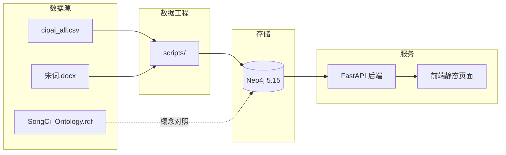

# 宋词知识发现系统

> 信息组织课程小组作业 · 数字人文方向  
> 围绕宋词及其声乐背景，完成「本体建模 → 图数据库 → Web 可视化」的完整技术链路。

---

## 项目简介

本系统将宋词领域的结构化数据（词牌 CSV）与非结构化文献（Word 文档）组织为知识图谱，并提供可交互的 Web 探索界面。三层架构各司其职：

| 层次 | 工具 | 职责 |
|------|------|------|
| 概念层（T-Box） | Protégé | 类与属性定义、HermiT 推理验证 |
| 数据层（A-Box） | Neo4j | 批量实例数据、关系网络、Cypher 查询 |
| 交互层 | Web 全栈应用 | 可视化探索、检索、时间轴过滤 |

**在线演示：** http://8.134.97.118:8083/

---

## 系统架构



---

## 功能特性

### Web 应用

- **力导向图谱**：基于 vis-network，展示词人、词牌、别称、作品、乐器、流派、朝代等节点及关系
- **搜索**：支持按词人、词牌、别称、乐器模糊检索，自动聚焦目标节点
- **朝代时间轴**：按唐五代 / 北宋 / 南宋 / 宋末过滤图谱
- **节点详情侧栏**：点击节点查看属性与关联实体
- **文献背景**：侧栏展示《宋词.docx》中的南宋声乐背景论述
- **图例交互**：点击图例类型筛选节点，支持清除恢复
- **移动端适配**：图例抽屉、底部详情面板、触屏优化

### 数据图谱

导入完成后预期规模：

| 节点类型 | 数量（约） |
|----------|-----------|
| Cipai（词牌） | 30 |
| Poet（词人） | 20 |
| Alias（别称） | 33 |
| Work（作品） | 32 |
| Instrument（乐器） | 3 |
| CiStyle（流派） | 3 |
| Period（朝代） | 4 |
| Context（文献背景） | 1 |

---

## 技术栈

| 模块 | 技术 |
|------|------|
| 本体建模 | Protégé 5.6 + HermiT |
| 图数据库 | Neo4j 5.15 |
| 后端 | Python 3.11 + FastAPI + neo4j-driver |
| 前端 | HTML / CSS / JavaScript + vis-network |
| 部署 | Docker Compose |

---

## 目录结构

```
Information_Organization/
├── README.md                  # 本文件
├── Dockerfile                 # Web 服务镜像
├── docker-compose.yml         # Neo4j + Web 一键启动
├── requirements.txt           # 数据脚本依赖
├── backend/                   # FastAPI 后端
│   ├── main.py
│   ├── db.py
│   ├── routers/graph.py       # API 路由
│   ├── cypher/graph.py        # Cypher 查询
│   └── services/graph_builder.py
├── frontend/dist/             # 前端静态资源
│   ├── index.html
│   └── assets/
├── data/                      # 结构化数据
│   ├── cipai_all.csv          # 主数据文件（30 条词牌）
│   └── 宋词.docx              # 文献数据（脚本生成）
├── scripts/                   # 数据导入脚本
│   ├── run_import.py          # 一键导入
│   ├── import_csv.py
│   ├── extract_docx.py
│   └── generate_docx.py
├── ontology/                  # Protégé 本体
│   └── SongCi_Ontology.rdf
└── document/                  # 项目文档
    ├── 实现路线文档.md
    ├── Neo4j查询说明.md
    └── Protege说明.md
```

---

## 快速开始（Docker 推荐）

### 环境要求

- Docker 20.10+
- Docker Compose v2

### 1. 克隆项目

```bash
git clone https://github.com/serenesoul-jpg/Information_Organization.git
cd Information_Organization
```

### 2. 启动服务

```bash
docker compose up -d
```

| 服务 | 地址 | 说明 |
|------|------|------|
| Web 应用 | http://localhost:8083 | 知识图谱可视化 |
| Neo4j Browser | http://localhost:7474 | 图数据库管理界面 |

Neo4j 默认账号：`neo4j` / `songci2026`

### 3. 导入数据（首次部署）

等待 Neo4j 就绪后执行：

```bash
docker run --rm --network information_organization_default \
  -v "$(pwd)":/app -w /app \
  -e NEO4J_URI=bolt://neo4j:7687 \
  -e NEO4J_PASSWORD=songci2026 \
  python:3.11-slim bash -c \
  "pip install -i https://mirrors.aliyun.com/pypi/simple/ neo4j pandas python-docx && python scripts/run_import.py"
```

### 4. 验证

```bash
# 检查容器状态
docker compose ps

# 检查 API
curl http://localhost:8083/api/health

# 检查数据（在容器内）
docker exec songci-web python -c "
from backend.db import get_driver
d = get_driver()
with d.session() as s:
    print('Cipai:', s.run('MATCH (c:Cipai) RETURN count(c)').single()[0])
"
```

---

## 本地开发

### 数据脚本（无需 Docker）

```bash
pip install -r requirements.txt

# 启动 Neo4j（Docker 或 Neo4j Desktop）
export NEO4J_PASSWORD=songci2026

# 一键导入
python scripts/run_import.py

# 校验
python scripts/verify_import.py
```

### 后端开发

```bash
pip install -r backend/requirements.txt
export NEO4J_URI=bolt://localhost:7687
export NEO4J_PASSWORD=songci2026

uvicorn backend.main:app --reload --port 8083
```

### 前端开发

前端为静态文件，位于 `frontend/dist/`。修改 HTML / CSS / JS 后重新构建 Docker 镜像或直接刷新（开发模式下由 FastAPI 托管静态文件）：

```bash
docker compose build web && docker compose up -d web
```

---

## API 接口

基础路径：`/api`

| 接口 | 方法 | 参数 | 说明 |
|------|------|------|------|
| `/graph` | GET | `period`, `limit` | 获取图谱数据（可按朝代过滤） |
| `/search` | GET | `q`, `limit` | 搜索词人/词牌/别称/乐器 |
| `/node/{id}` | GET | — | 节点详情及关联实体 |
| `/timeline` | GET | — | 各朝代词人数量统计 |
| `/context` | GET | — | 文献背景文本 |
| `/health` | GET | — | 健康检查 |

**示例：**

```bash
# 全图
curl "http://localhost:8083/api/graph?limit=120"

# 南宋过滤
curl "http://localhost:8083/api/graph?period=南宋"

# 搜索苏轼
curl "http://localhost:8083/api/search?q=苏轼"
```

**返回格式：**

```json
{
  "nodes": [
    { "id": "...", "label": "苏轼", "group": "Poet", "color": "#4A90D9", "properties": {} }
  ],
  "links": [
    { "source": "...", "target": "...", "type": "REPRESENT" }
  ]
}
```

---

## 图谱 Schema

### 节点标签

| 标签 | 含义 | 主要属性 |
|------|------|----------|
| `:Poet` | 词人 | name, note |
| `:Cipai` | 词牌 | name, alias, type, famous_line |
| `:Alias` | 别称 | name |
| `:Work` | 作品 | title, famous_line |
| `:Instrument` | 乐器 | name, description |
| `:CiStyle` | 流派 | name |
| `:Period` | 朝代 | name |
| `:Context` | 文献背景 | title, content |

### 关系类型

| 关系 | 起止 | 含义 |
|------|------|------|
| `REPRESENT` | Poet → Cipai | 代表词人 |
| `HAS_ALIAS` | Cipai → Alias | 词牌别称 |
| `WROTE` | Poet → Work | 创作作品 |
| `USES_CIPAI` | Work → Cipai | 作品使用词牌 |
| `ACCOMPANIED_BY` | Cipai → Instrument | 伴奏乐器 |
| `BELONGS_TO` | Poet → CiStyle | 所属流派 |
| `ACTIVE_IN` | Poet → Period | 活跃时期 |

OWL 概念与 Neo4j 标签的对照见 [`ontology/README.md`](ontology/README.md)。

---

## 答辩演示建议

按以下顺序操作 Web 应用（约 3–4 分钟）：

1. 打开首页，介绍整体布局（搜索栏、图谱、时间轴、侧栏）
2. **搜索「苏轼」** → 图谱聚焦，展示词人关联词牌
3. **点击「念奴娇」** → 侧栏展示别称、名句、词体类型
4. **时间轴切换「南宋」** → 展示图谱过滤效果
5. **点击「笙」** → 展示长调词牌与清雅派词人关联
6. **点击「文献」按钮** → 朗读背景论述（靖康南渡、笙与慢词融合）
7. 切换至 Neo4j Browser，执行 `document/Neo4j查询说明.md` 中的 Cypher 演示查询

---

## 常用运维命令

```bash
# 查看服务状态
docker compose ps

# 查看日志
docker compose logs -f web

# 重启 Web 服务
docker compose restart web

# 停止所有服务
docker compose down

# 停止并清除 Neo4j 数据（慎用）
docker compose down -v
```

---

## 相关文档

| 文档 | 说明 |
|------|------|
| [`document/实现路线文档.md`](document/实现路线文档.md) | 完整开发路线与分工建议 |
| [`document/Neo4j查询说明.md`](document/Neo4j查询说明.md) | 答辩用 Cypher 查询手册 |
| [`document/Protege说明.md`](document/Protege说明.md) | 本体建模说明 |
| [`ontology/README.md`](ontology/README.md) | OWL 与 Neo4j 概念对照 |
| [`data/README.md`](data/README.md) | 数据字段与清洗规则 |

---

## 许可证

本项目为课程作业用途，数据来源于公开整理的宋词词牌资料。
