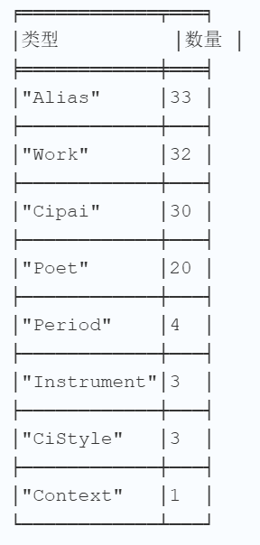
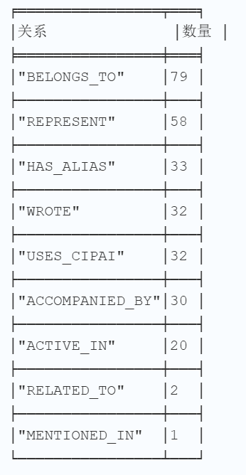
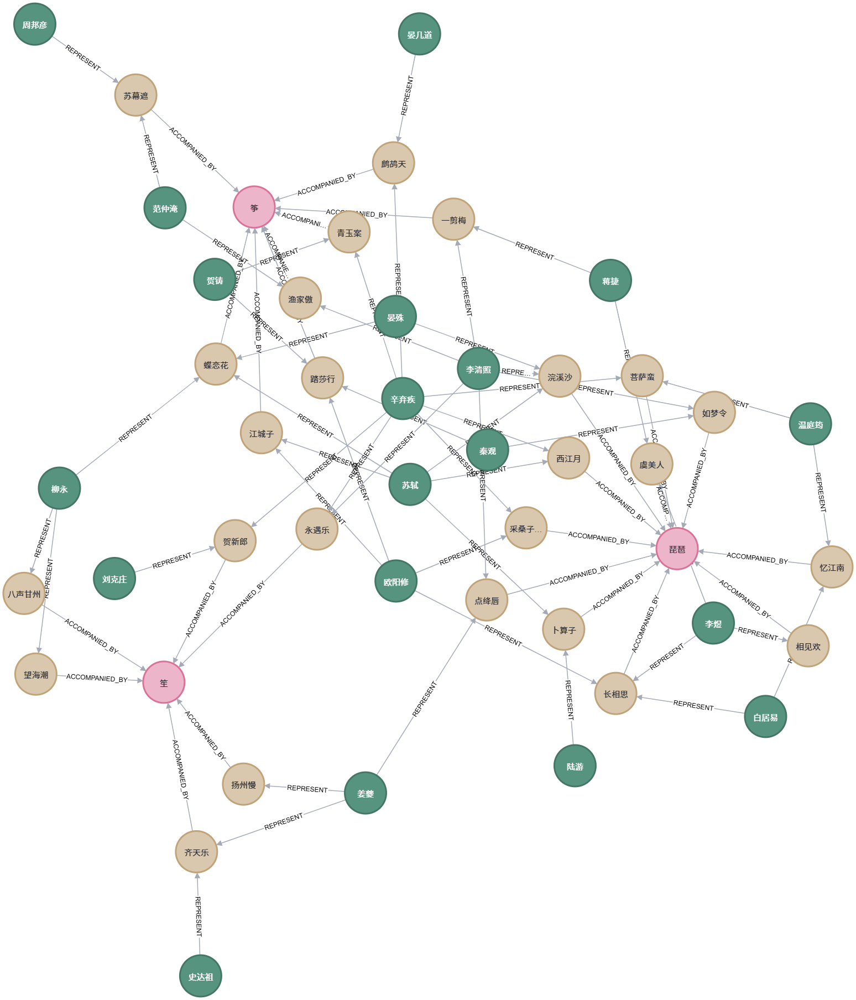
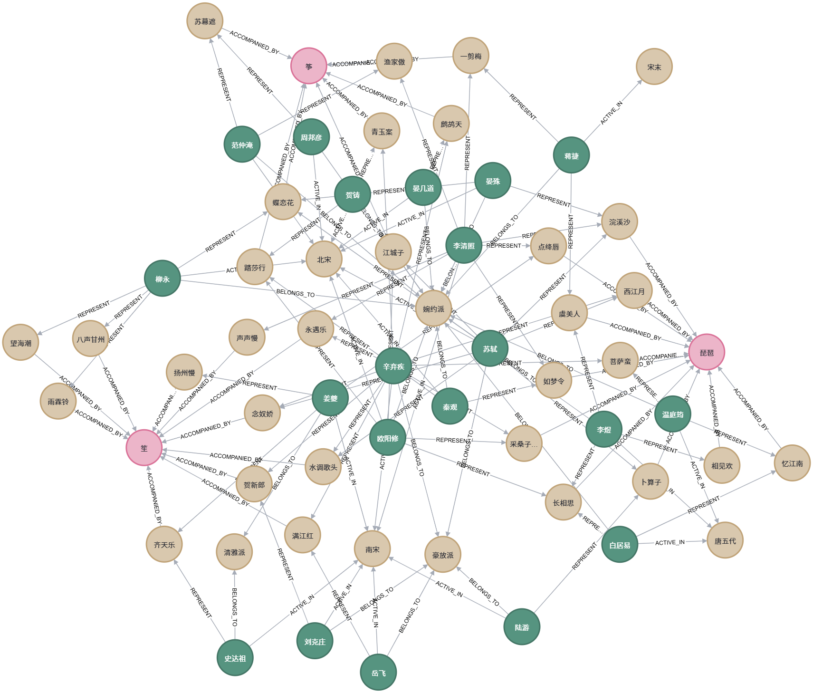
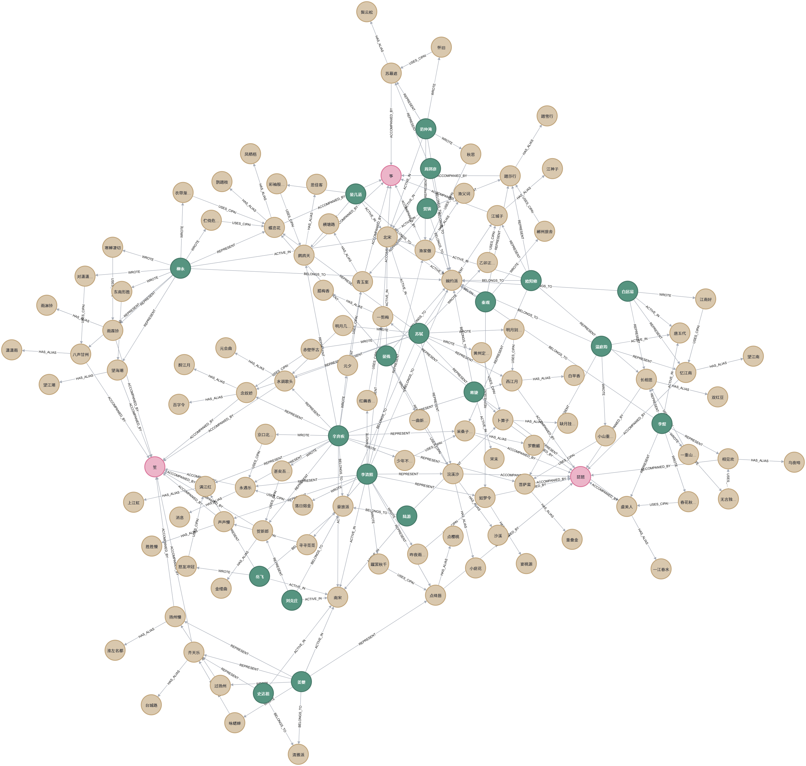
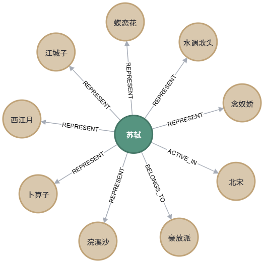
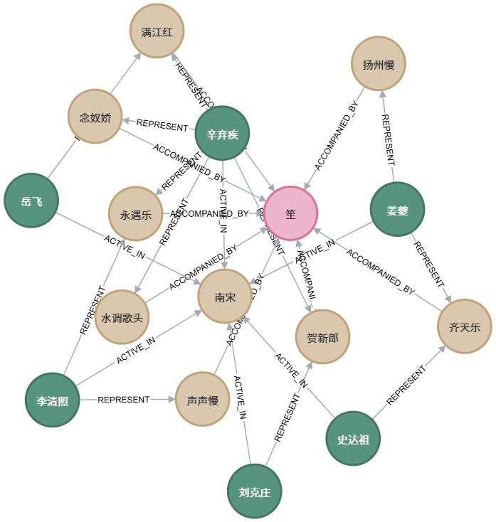

# Neo4j 查询说明

> 宋词知识图谱 · Cypher 查询手册  
> 在 Neo4j Browser（http://localhost:7474）中粘贴运行。统计类查询请切换到 **Table** 视图，演示类查询使用 **Graph** 视图。

---

## 图谱结构速查

| 节点 | 含义 |
|------|------|
| `:Poet` | 词人 |
| `:Cipai` | 词牌 |
| `:Alias` | 别称 |
| `:Work` | 作品 |
| `:Instrument` | 乐器 |
| `:CiStyle` | 流派 |
| `:Period` | 朝代 |
| `:Context` | 文献背景 |

| 关系 | 含义 |
|------|------|
| `REPRESENT` | 词人代表某词牌 |
| `HAS_ALIAS` | 词牌有别称 |
| `WROTE` | 词人创作作品 |
| `USES_CIPAI` | 作品使用某词牌 |
| `ACCOMPANIED_BY` | 词牌伴奏乐器 |
| `BELONGS_TO` | 词人属某流派 |
| `ACTIVE_IN` | 词人活跃于某朝代 |
| `RELATED_TO` / `MENTIONED_IN` | 实体与文献背景的关联 |

**提示：** 若图中出现 `Variety`、`Brand` 等与宋词无关的节点，是同一 Neo4j 实例中的其他数据。从 `:Cipai` 且 `c.type IS NOT NULL` 出发可过滤出宋词子图。

---

## 一、数据规模确认（答辩开场用）

### 1.1 各类型节点数量

**用途：** 向老师说明「我们导入了多少实体」，体现数据工程成果。建议在 Table 视图查看。

```cypher
MATCH (n)
WHERE n:Cipai OR n:Poet OR n:Alias OR n:Work
   OR n:Instrument OR n:CiStyle OR n:Period OR n:Context
RETURN labels(n)[0] AS 类型, count(*) AS 数量
ORDER BY 数量 DESC
```



---

### 1.2 各类型关系数量

**用途：** 展示关系网络的丰富程度，说明不仅是节点堆砌，还有语义关联。

```cypher
MATCH ()-[r]->()
WHERE type(r) IN [
  'REPRESENT', 'HAS_ALIAS', 'WROTE', 'USES_CIPAI',
  'ACCOMPANIED_BY', 'BELONGS_TO', 'ACTIVE_IN',
  'RELATED_TO', 'MENTIONED_IN'
]
RETURN type(r) AS 关系, count(*) AS 数量
ORDER BY 数量 DESC
```



---

### 1.3 完整路径总数

**用途：** 验证「词人 → 词牌 → 乐器」核心链路是否完整。预期约 **58** 条。

```cypher
MATCH (p:Poet)-[:REPRESENT]->(c:Cipai)-[:ACCOMPANIED_BY]->(i:Instrument)
RETURN count(*) AS 路径数
```


---

## 二、图谱可视化演示（答辩核心）

### 2.1 基础链路：词人 → 词牌 → 乐器

**用途：** 最简演示，展示 CSV 导入后的核心三角关系。适合快速介绍项目。

```cypher
MATCH (p:Poet)-[:REPRESENT]->(c:Cipai)-[:ACCOMPANIED_BY]->(i:Instrument)
RETURN p, c, i
LIMIT 50
```



---

### 2.2 完整宋词子图（含流派、朝代）

**用途：** 在基础链路上叠加 Word 文献补充的流派与朝代，体现多源数据融合。

```cypher
MATCH (p:Poet)-[r1:REPRESENT]->(c:Cipai)-[r2:ACCOMPANIED_BY]->(i:Instrument)
OPTIONAL MATCH (p)-[:BELONGS_TO]->(s:CiStyle)
OPTIONAL MATCH (p)-[:ACTIVE_IN]->(per:Period)
RETURN p, c, i, s, per, r1, r2
```



---

### 2.3 最丰富子图（含别称、作品）★ 推荐

**用途：** 展示别称节点、作品节点导入后的完整图谱，节点数最多，视觉冲击最强。

```cypher
MATCH (c:Cipai)
WHERE c.type IS NOT NULL
OPTIONAL MATCH (c)-[:HAS_ALIAS]->(a:Alias)
OPTIONAL MATCH (w:Work)-[:USES_CIPAI]->(c)
OPTIONAL MATCH (p:Poet)-[:WROTE]->(w)
OPTIONAL MATCH (p2:Poet)-[:REPRESENT]->(c)
OPTIONAL MATCH (c)-[:ACCOMPANIED_BY]->(i:Instrument)
OPTIONAL MATCH (p2)-[:BELONGS_TO]->(s:CiStyle)
OPTIONAL MATCH (p2)-[:ACTIVE_IN]->(per:Period)
RETURN c, a, w, p, p2, i, s, per
LIMIT 120
```



---

### 2.4 单个词牌展开（如「念奴娇」）

**用途：** 聚焦一个词牌，展示其别称、作品、代表词人等全部关联，适合逐点讲解。

```cypher
MATCH (c:Cipai {name: '念奴娇'})
OPTIONAL MATCH (c)-[r1]->(n1)
OPTIONAL MATCH (n2)-[r2]->(c)
RETURN c, r1, n1, r2, n2
```


---

### 2.5 某位词人的星状网络（如苏轼）

**用途：** 模拟前端「搜索词人」后的聚焦效果，展示该词人的词牌、作品、流派等全部关系。

```cypher
MATCH (p:Poet {name: '苏轼'})
OPTIONAL MATCH (p)-[r]->(n)
RETURN p, r, n
```



---

### 2.6 南宋 + 长调 + 笙（时间轴演示）

**用途：** 体现「靖康南渡后，长调慢词与笙融合」的课程论点，适合结合 Word 文献口述。

```cypher
MATCH (p:Poet)-[:ACTIVE_IN]->(per:Period {name: '南宋'})
MATCH (p)-[:REPRESENT]->(c:Cipai {type: '长调'})-[:ACCOMPANIED_BY]->(i:Instrument {name: '笙'})
RETURN p, per, c, i
```



---

### 2.7 清雅派词人及其作品

**用途：** 展示流派—词人—作品—词牌的多层结构，突出姜夔、史达祖等南宋雅词代表。

```cypher
MATCH (p:Poet)-[:BELONGS_TO]->(s:CiStyle {name: '清雅派'})
MATCH (p)-[:REPRESENT]->(c:Cipai)
OPTIONAL MATCH (p)-[:WROTE]->(w:Work)-[:USES_CIPAI]->(c)
RETURN p, s, c, w
```


---

### 2.8 按词体分开展示

**用途：** 说明词体长度与伴奏乐器的对应规律（小令→琵琶，中调→筝，长调→笙）。

**小令：**

```cypher
MATCH (c:Cipai {type: '小令'})-[:ACCOMPANIED_BY]->(i:Instrument)
RETURN c, i
```


**中调：**

```cypher
MATCH (c:Cipai {type: '中调'})-[:ACCOMPANIED_BY]->(i:Instrument)
RETURN c, i
```


**长调：**

```cypher
MATCH (c:Cipai {type: '长调'})-[:ACCOMPANIED_BY]->(i:Instrument)
RETURN c, i
```


---

## 三、别称与作品专项

### 3.1 某词牌的所有别称

**用途：** 展示「别称节点化」的结构化成果，说明同一词牌可有多个名称。

```cypher
MATCH (c:Cipai {name: '念奴娇'})-[:HAS_ALIAS]->(a:Alias)
RETURN c.name AS 词牌, collect(a.name) AS 别称
```


---

### 3.2 通过别称反查词牌

**用途：** 演示「用户输入百字令，系统找到念奴娇」的检索逻辑。

```cypher
MATCH (c:Cipai)-[:HAS_ALIAS]->(a:Alias {name: '百字令'})
RETURN c.name AS 词牌, a.name AS 别称
```


---

### 3.3 作品、名句、词牌、词人一览

**用途：** 以表格形式展示结构化后的作品数据，适合 PPT 截图。

```cypher
MATCH (p:Poet)-[:WROTE]->(w:Work)-[:USES_CIPAI]->(c:Cipai)
RETURN p.name AS 词人,
       w.title AS 作品,
       w.famous_line AS 名句,
       c.name AS 词牌,
       c.type AS 词体
ORDER BY 词人, 词牌
LIMIT 30
```


---

### 3.4 含名句的作品

**用途：** 筛选有名句摘录的作品，用于前端详情面板的数据来源说明。

```cypher
MATCH (p:Poet)-[:WROTE]->(w:Work)
WHERE w.famous_line IS NOT NULL AND w.famous_line <> ''
RETURN p.name AS 词人, w.title AS 作品, w.famous_line AS 名句
LIMIT 20
```


---

## 四、统计与对比分析

### 4.1 各流派词人数

**用途：** 量化分析豪放派、婉约派、清雅派的人员规模。

```cypher
MATCH (p:Poet)-[:BELONGS_TO]->(s:CiStyle)
RETURN s.name AS 流派, count(p) AS 词人数
ORDER BY 词人数 DESC
```


---

### 4.2 各朝代词人数

**用途：** 配合时间轴功能，说明不同朝代的词人分布。

```cypher
MATCH (p:Poet)-[:ACTIVE_IN]->(per:Period)
RETURN per.name AS 朝代, count(p) AS 词人数
ORDER BY 词人数 DESC
```


---

### 4.3 每位词人代表词牌数

**用途：** 找出「涉猎最广」的词人（如辛弃疾、苏轼），体现数据洞察。

```cypher
MATCH (p:Poet)-[:REPRESENT]->(c:Cipai)
RETURN p.name AS 词人, count(c) AS 词牌数
ORDER BY 词牌数 DESC
```


---

### 4.4 各词体对应乐器

**用途：** 验证词体—乐器映射规则是否正确导入。

```cypher
MATCH (c:Cipai)-[:ACCOMPANIED_BY]->(i:Instrument)
RETURN c.type AS 词体, i.name AS 乐器, count(c) AS 词牌数
ORDER BY 词体
```


---

### 4.5 某位词人的作品列表

**用途：** 展示单个词人的创作清单，可替换 `{name: '辛弃疾'}` 为任意词人。

```cypher
MATCH (p:Poet {name: '辛弃疾'})-[:WROTE]->(w:Work)
RETURN p.name AS 词人, collect(w.title) AS 作品列表
```


---

## 五、文献背景（Context）

### 5.1 查看背景论述文本

**用途：** 读取 Word 文献导入的背景节点，答辩时可朗读其中结论句。

```cypher
MATCH (ctx:Context {title: '南宋声乐背景'})
RETURN ctx.content AS 背景论述
```


---

### 5.2 背景与实体的关联

**用途：** 展示文献节点如何与朝代、流派、乐器建立语义链接。

```cypher
MATCH (n)-[r:RELATED_TO|MENTIONED_IN]->(ctx:Context)
RETURN labels(n)[0] AS 类型, n.name AS 名称, type(r) AS 关系, ctx.title AS 文献
```


---

## 六、检索式查询（模拟搜索）

### 6.1 模糊搜索词人

**用途：** 模拟前端搜索框，输入姓氏即可列出相关词人及其词牌。

```cypher
MATCH (p:Poet)
WHERE p.name CONTAINS '苏'
OPTIONAL MATCH (p)-[:REPRESENT]->(c:Cipai)
RETURN p.name AS 词人, collect(c.name) AS 代表词牌
```


---

### 6.2 模糊搜索词牌或别称

**用途：** 支持按词牌名或别称检索，体现信息组织的检索能力。

```cypher
MATCH (c:Cipai)
WHERE c.name CONTAINS '奴' OR c.alias CONTAINS '奴'
OPTIONAL MATCH (c)-[:HAS_ALIAS]->(a:Alias)
RETURN c.name AS 词牌, c.alias AS 别称属性, collect(a.name) AS 别称节点
```


---

### 6.3 按乐器检索关联网络

**用途：** 点击「笙」节点时前端应展示的关联范围，可替换乐器名称。

```cypher
MATCH (i:Instrument {name: '笙'})<-[:ACCOMPANIED_BY]-(c:Cipai)<-[:REPRESENT]-(p:Poet)
RETURN i.name AS 乐器, c.name AS 词牌, c.type AS 词体, p.name AS 词人
```


---

## 七、路径与知识发现

### 7.1 词人到乐器的最短路径

**用途：** 展示「姜夔如何通过词牌、作品等节点关联到笙」，体现图数据库的路径分析优势。

```cypher
MATCH path = shortestPath(
  (p:Poet {name: '姜夔'})-[*..4]-(i:Instrument {name: '笙'})
)
RETURN path
```


---

### 7.2 两位词人的共同词牌

**用途：** 发现苏轼与辛弃疾的交集，可用于对比分析。

```cypher
MATCH (p1:Poet {name: '苏轼'})-[:REPRESENT]->(c:Cipai)<-[:REPRESENT]-(p2:Poet {name: '辛弃疾'})
RETURN c.name AS 共同词牌, c.type AS 词体
```


---

### 7.3 流派与词体交叉统计

**用途：** 分析「豪放派偏好长调还是中调」等规律，体现数据挖掘深度。

```cypher
MATCH (p:Poet)-[:BELONGS_TO]->(s:CiStyle)
MATCH (p)-[:REPRESENT]->(c:Cipai)
RETURN s.name AS 流派, c.type AS 词体, count(*) AS 次数
ORDER BY 流派, 次数 DESC
```


---

## 八、答辩演示顺序建议

| 顺序 | 查询编号 | 讲解要点 |
|------|----------|----------|
| 1 | 1.1 + 1.2 | 数据规模：导入了多少节点和关系 |
| 2 | 2.3 | 完整图谱：别称、作品、流派、朝代 |
| 3 | 2.5 | 聚焦苏轼：模拟前端搜索 |
| 4 | 2.6 | 南宋 + 笙：结合文献背景论述 |
| 5 | 3.3 或 4.3 | 表格数据：结构化成果 |
| 6 | 7.1 | 路径分析：图数据库的独特价值 |

---

## 九、截图文件命名对照

将 Neo4j Browser 截图保存至 `document/img/`，文件名与上文占位一致：

| 文件名 | 对应查询 |
|--------|----------|
| `graph1.png` | 2.1 基础链路 |
| `graph2.png` | 2.2 完整子图 |
| `graph3.png` | 2.5 苏轼星状网络 |
| `graph4.png` | 2.6 南宋长调笙 |
| `graph5.png` ~ `graph30.png` | 其余各节查询 |

已有 `graph1` ~ `graph4` 可直接沿用；其余位置运行对应查询后，将截图保存为 `document/img/graphN.png` 即可。
