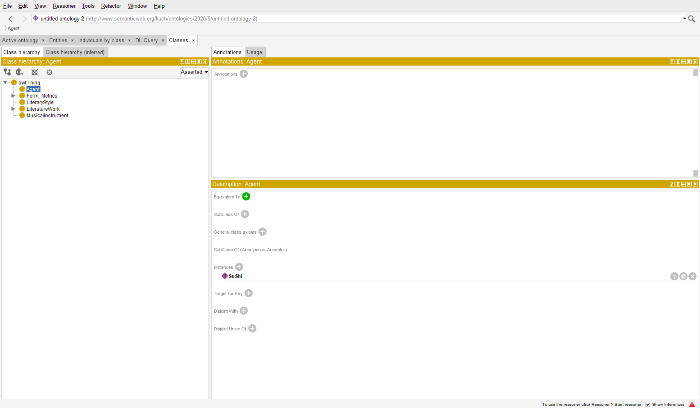
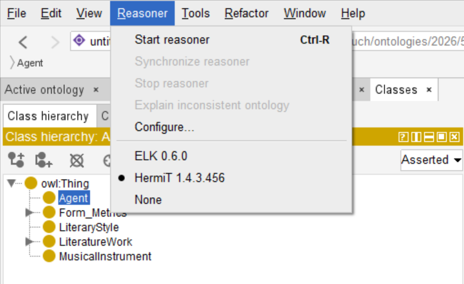

# Protégé 本体说明

## HermiT 推理验证

基于 HermiT 推理机完成本体一致性检测与逻辑验证。





---

## 本体文件

| 项目 | 内容 |
|------|------|
| 文件位置 | `ontology/SongCi_Ontology.rdf` |
| 命名空间 | `http://www.semanticweb.org/liuch/ontologies/2026/5/untitled-ontology-2#` |
| 详细文档 | 见 [`ontology/README.md`](../ontology/README.md) |

---

## 核心类（T-Box）

- **Agent** — 主体（词人）
- **LiteratureWork / Songci** — 文学作品 / 宋词
- **Form_Metrics / Cipai** — 形式格律 / 词牌
- **MusicalInstrument** — 乐器
- **LiteraryStyle** — 流派

---

## Demo 实例（A-Box 样例）

| 个体 | 类型 | 说明 |
|------|------|------|
| SuShi | Agent | 苏轼 |
| NianNujiao | Cipai | 念奴娇，别称「百词令」 |
| 关系 | SuShi —write→ NianNujiao | 创作关系 |

批量实例数据（30 词牌、20 词人等）见 Neo4j，导入方式见 [`Neo4j查询说明.md`](Neo4j查询说明.md)。

---

## 与 Neo4j 的关系

```
Protégé（概念层）          Neo4j（实例层）
─────────────────         ─────────────────
Cipai                  →  :Cipai
Agent / write          →  :Poet -[:WROTE]-> :Work
hasAlternativeName     →  :Alias + HAS_ALIAS
MusicalInstrument      →  :Instrument
LiteraryStyle          →  :CiStyle
（待扩展 Period）       →  :Period
```

答辩话术示例：「我们先用 Protégé 定义符合 OWL 标准的概念框架，再用 Python 脚本将 CSV 与 Word 文献结构化导入 Neo4j，实现从 T-Box 到 A-Box 的完整链路。」
